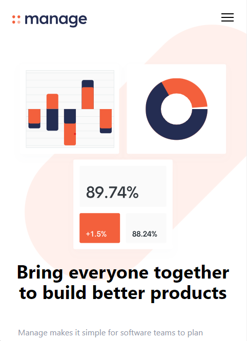

# Frontend Mentor - Manage landing page solution

This is a solution to the [Manage landing page challenge on Frontend Mentor](https://www.frontendmentor.io/challenges/manage-landing-page-SLXqC6P5). Frontend Mentor challenges help you improve your coding skills by building realistic projects. 

## Table of contents

- [Overview](#overview)
  - [The challenge](#the-challenge)
  - [Screenshot](#screenshot)
  - [Links](#links)
- [My process](#my-process)
  - [Built with](#built-with)
  - [What I learned](#what-i-learned)
  - [Continued development](#continued-development)
  - [Useful resources](#useful-resources)
- [Author](#author)
- [Acknowledgments](#acknowledgments)

## Overview

### The challenge

Users should be able to:

- View the optimal layout for the site depending on their device's screen size
- See hover states for all interactive elements on the page
- See all testimonials in a horizontal slider
- Receive an error message when the newsletter sign up `form` is submitted if:
  - The `input` field is empty
  - The email address is not formatted correctly

### Screenshot
- Desktop Screen


- Mobile Screen



### Links

- Live Site URL: [Github page](https://eshrakrahman.github.io/Manage_LandingPage_Design_TailwindCss/)

## My process

### Built with

- Semantic HTML5 markup
- TailwindCSS
- CSS custom properties
- Mobile-first workflow
- Javascript
- DOM manipulation

### What I learned

Through the completion of this project, I have gained valuable insights into effectively utilizing Tailwind CSS within a project, adeptly employing diverse class names to craft an engaging and aesthetically pleasing landing page. Additionally, I have delved into JavaScript implementation, successfully creating a dynamic hamburger menu that enhances user experience. Embracing the principle of mobile-first design, I have honed my skills in developing layouts that seamlessly adapt to various screen sizes. Moreover, my comprehension of flexbox has expanded significantly, as I harnessed its versatile capabilities to structure and align page elements with precision and finesse. This project has not only enriched my understanding of these key concepts but has also equipped me with practical expertise that will undoubtedly prove invaluable in future design and development endeavors.


```html
<h1>Some HTML code I'm proud of</h1>
```
```css
.open .hamburger-top {
  transform: rotate(45deg) translateY(6px) translate(6px);
}
.open .hamburger-middle {
  display: none;
}

.open .hamburger-bottom {
  transform: rotate(-45deg) translateY(6px) translate(-6px);
}
```
```js
const btn = document.getElementById('menu-btn');
const nav = document.getElementById('menu');

btn.addEventListener('click', () => {
  btn.classList.toggle('open')
  nav.classList.toggle('flex')
  nav.classList.toggle('hidden')
})
```

### Continued development

- Fixing some spacing problem between elements
- Add more interactivity through vanilaJs
- all testimonials in a horizontal slider
- Receive an error message when the newsletter sign up `form` is submitted if:
  - The `input` field is empty
  - The email address is not formatted correctly


### Useful resources

- [Tailwindcss Documentation](https://tailwindcss.com/docs/installation) - This documentation provided guidance on installing Tailwind via the CLI.

- [CSS Tricks](https://css-tricks.com/snippets/css/a-guide-to-flexbox/) - This is an amazing article which helped me finally understand flexbox. I'd recommend it to anyone still learning this concept.

## Author

- Eshrak Rahman - [Github](https://github.com/EshrakRahman)

## Acknowledgments

This project was completed with the assistance of Traversy Media from YouTube.

